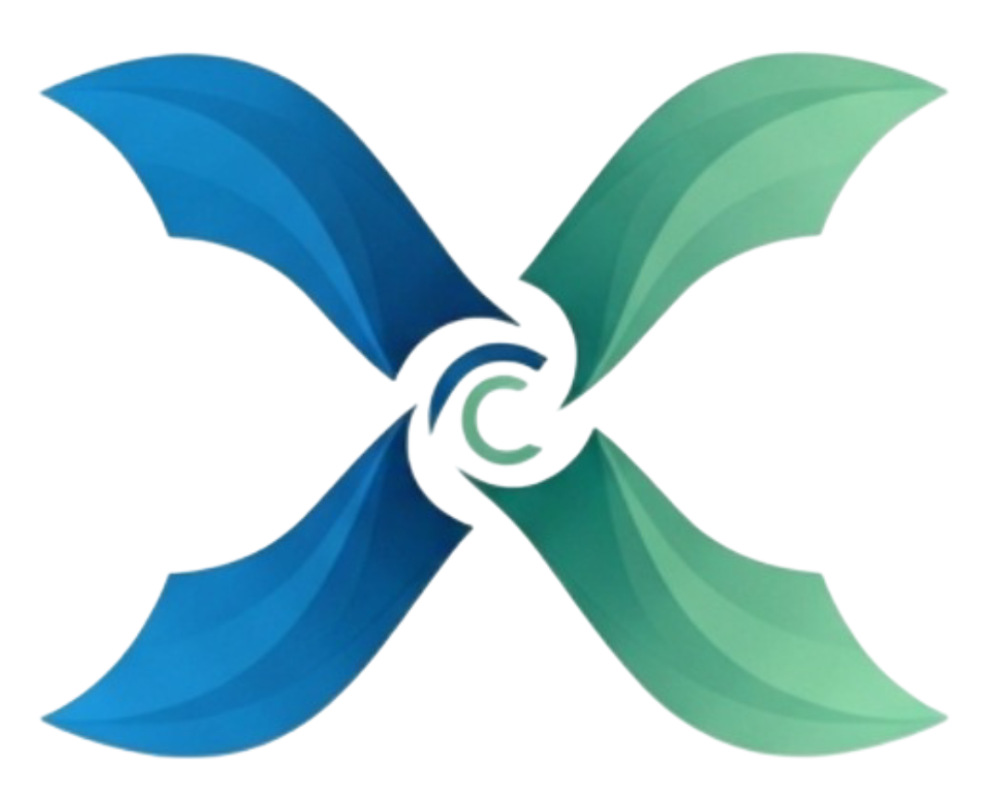

<div align="center">
  
</div>

# XDC Network Manager Frontend

A modern TypeScript + React + Vite web application for interacting with the NetworkManager contract on the XDC blockchain subnet. This application provides a comprehensive interface to manage network members, update their details, check their status, and transfer the manager role with built-in MetaMask integration and automatic network detection.

## Features

### Core Functionality
- View all network members and their details with real-time updates
- Add new members with X.500 distinguished name and public key
- Update existing member details (X.500 name, public key)
- Remove members from the network
- Update member status (active/inactive)
- Transfer manager role to a new address
- Search and filter members
- Responsive UI with Bootstrap 5

### Connection Options
- **MetaMask Integration** - Connect using your MetaMask wallet with automatic account switching
- **Direct RPC Connection** - Connect directly to subnet node RPC endpoint
- **Automatic Network Detection** - Detects and validates you're on the correct network
- **One-Click Network Switching** - Automatically add and switch to XDC Subnet in MetaMask

### Security & User Experience
- Transaction confirmation via MetaMask
- Clear error messages and validation
- Toast notifications for all operations
- Persistent connection state
- Real-time network status monitoring

## Prerequisites

### For Development
- Node.js 18+ (recommended: latest LTS)
- npm or pnpm package manager
- MetaMask browser extension (for wallet features)
- Access to an XDC subnet node
- Deployed NetworkManager contract

### For Docker Deployment
- Docker 20.10+
- Docker Compose 2.0+
- Access to an XDC subnet node
- Deployed NetworkManager contract

## Installation and Setup

### Development Mode

1. Clone the repository and navigate to the frontend directory:
   ```bash
   cd frontend
   ```

2. Install dependencies:
   ```bash
   npm install
   ```

3. Create a `.env` file based on `.env.example`:
   ```bash
   cp .env.example .env
   ```

4. Edit the `.env` file and set your XDC subnet RPC URL and contract address:
   ```
   VITE_DEFAULT_RPC_URL=http://127.0.0.1:8545
   VITE_DEFAULT_CONTRACT_ADDRESS=0x77627475E80d57c66a2B7ad57400802b85478d6e
   VITE_SUBNET_CHAIN_ID=57539
   ```

5. Start the development server:
   ```bash
   npm run dev
   ```
   Or alternatively:
   ```bash
   npm start
   ```

6. Open http://localhost:5173 in your browser (Vite default port)

### Docker Deployment

1. Make sure Docker and Docker Compose are installed and running.

2. Ensure the `docker_net` network exists (shared with contracts and subnet):
   ```bash
   docker network create docker_net
   ```

3. Navigate to the frontend directory:
   ```bash
   cd frontend
   ```

4. Configure environment in `docker.env`:
   ```bash
   # Edit docker.env with your configuration
   VITE_DEFAULT_RPC_URL=http://192.168.25.11:8545
   VITE_DEFAULT_CONTRACT_ADDRESS=0x77627475E80d57c66a2B7ad57400802b85478d6e
   VITE_SUBNET_CHAIN_ID=57539
   ```

5. Build and start the Docker container using the provided script:
   ```bash
   ./run.sh
   ```
   
   **Alternative:** You can also use docker-compose directly:
   ```bash
   docker-compose up -d --build
   ```

6. Access the application at http://localhost:3000

7. To stop the container:
   ```bash
   ./run.sh stop
   ```
   
   **Alternative:** Using docker-compose directly:
   ```bash
   docker-compose down
   ```

8. View logs:
   ```bash
   docker-compose logs -f frontend
   ```

**Note:** The `run.sh` script provides additional features:
- Automatically checks if Docker is running
- Creates the `docker_net` network if it doesn't exist
- Detects if containers are already running and prompts for restart
- Provides colored output for better readability
- Shows container logs automatically after startup

**Note:** The Docker configuration uses the shared `docker_net` network, allowing frontend to communicate with the XDC subnet and contracts containers.

## Configuration Options

### Environment Variables

The application uses Vite for building and development. Environment variables must be prefixed with `VITE_`:

| Variable                          | Description                             | Default                    |
|-----------------------------------|-----------------------------------------|----------------------------|
| VITE_DEFAULT_RPC_URL              | Default XDC subnet RPC URL              | http://192.168.25.11:8545  |
| VITE_DEFAULT_CONTRACT_ADDRESS     | Default NetworkManager contract address | 0x77627475E80d57c66a2B7ad57400802b85478d6e |
| VITE_SUBNET_CHAIN_ID              | XDC Subnet Chain ID (decimal)           | 57539                      |

**Note:** After changing environment variables, restart the development server for changes to take effect.

### Docker Configuration

The Docker setup follows the same pattern as the contracts configuration:

- **docker.env**: Environment variables for Docker deployment
- **docker-compose.yml**: Service definition with volume mounts for hot-reload
- **Dockerfile**: Development-ready image with bash support
- **Shared Network**: Uses `docker_net` (same as contracts and subnet)

You can customize the Docker deployment by editing these files:

- Change the exposed port by modifying the `ports` section in docker-compose.yml
- Update environment variables in docker.env
- Adjust volume mounts for additional configuration files

## Connecting to the XDC Subnet

### Option 1: Connect with MetaMask (Recommended)

1. **Install MetaMask**
   - Install the MetaMask browser extension from https://metamask.io
   - Create or import a wallet

2. **Start the application**
   - The app will automatically detect MetaMask

3. **Connect**
   - Enter the NetworkManager contract address: `0x77627475E80d57c66a2B7ad57400802b85478d6e`
   - Click "Connect with MetaMask"
   - Approve the connection in the MetaMask popup

4. **Network Detection**
   - The app automatically detects your current network
   - If you're on the wrong network, click "Switch to XDC Subnet"
   - If the XDC Subnet isn't configured, click "Add XDC Subnet Network"

5. Once connected, you'll see the main dashboard showing network members and the current manager.

### Option 2: Direct RPC Connection

1. **Start your XDC subnet**
   - Ensure your subnet nodes are running

2. **Connect**
   - Enter the RPC URL: `http://127.0.0.1:8545`
   - Enter the contract address: `0x77627475E80d57c66a2B7ad57400802b85478d6e`
   - Click "Connect"

3. The app will use the first account from the node's keystore

**For detailed guides, see:**
- [MetaMask Integration Guide](./METAMASK_INTEGRATION.md)
- [Network Detection Guide](./NETWORK_DETECTION.md)

## Usage Instructions

### Viewing Network Members

1. After connecting, the "Members" tab will display all network members.
2. Search for specific members using the search box.
3. Click on a member from the list to view their detailed information.

### Adding New Members (Manager Only)

1. Navigate to the "Add Member" tab (visible only to the manager).
2. Fill in the required information:
   - Member Address: The Ethereum/XDC address of the new member
   - X.500 Distinguished Name: The X.500 name in the format `CN=Name,O=Organization,C=Country`
   - Public Key: The member's public key
3. Click "Add Member" to add the member to the network.

### Updating Member Details (Manager Only)

1. Navigate to the "Update Member" tab (visible only to the manager).
2. Select a member from the dropdown list.
3. Modify the X.500 name or public key.
4. Click "Update Member" to save the changes.

### Updating Member Status (Manager Only)

1. Select a member from the member list.
2. In the member details panel, click "Set Active" or "Set Inactive" to change the member's status.

### Removing a Member (Manager Only)

1. Select a member from the member list.
2. In the member details panel, click "Remove Member".
3. Confirm the action when prompted.

### Transferring Manager Role (Manager Only)

1. Navigate to the "Contract Management" tab (visible only to the manager).
2. Enter the Ethereum/XDC address of the new manager.
3. Click "Transfer Manager Role".
4. Confirm the action when prompted.

## Technology Stack

- **Frontend Framework:** React 19 with TypeScript
- **Build Tool:** Vite 6
- **UI Framework:** Bootstrap 5 + React-Bootstrap 2
- **Web3 Library:** Web3.js 4.16
- **Notifications:** React Toastify
- **Web Server (Production):** Nginx
- **Containerization:** Docker + Docker Compose

## Project Structure

```
frontend/
├── src/
│   ├── components/          # React components
│   │   ├── ConnectionPanel.tsx    # Connection UI with MetaMask
│   │   ├── Navigation.tsx          # Navigation bar
│   │   ├── NetworkInfo.tsx         # Network status display
│   │   ├── MemberList.tsx          # Member listing
│   │   ├── MemberDetails.tsx       # Member detail view
│   │   ├── AddMemberForm.tsx       # Add member form
│   │   ├── UpdateMemberForm.tsx    # Update member form
│   │   └── ManageContract.tsx      # Manager operations
│   ├── hooks/
│   │   └── useContract.ts          # Contract interaction hook
│   ├── utils/
│   │   ├── contractHelpers.ts      # Web3 and contract utilities
│   │   └── validationHelpers.ts    # Input validation
│   ├── types/
│   │   └── contract.ts             # TypeScript type definitions
│   ├── contracts/
│   │   ├── NetworkManager.abi.json # Contract ABI
│   │   └── NetworkManager.abi.ts   # Typed ABI export
│   ├── App.tsx                      # Main application component
│   └── index.tsx                    # Application entry point
├── public/                          # Static assets
├── nginx/                           # Nginx configuration for production
├── Dockerfile                       # Docker image definition
├── docker-compose.yml               # Docker Compose configuration
├── docker.env                       # Docker environment variables
├── .env.example                     # Local development env template
├── vite.config.ts                   # Vite configuration
├── tsconfig.json                    # TypeScript configuration
└── package.json                     # Dependencies and scripts
```

## Security Considerations

### For Users
- ✅ Always review transactions in MetaMask before approving
- ✅ Verify contract addresses before connecting
- ✅ Keep your MetaMask seed phrase secure and private
- ✅ Only connect to trusted RPC endpoints
- ⚠️ Never share your private keys or seed phrases
- ⚠️ Be cautious when transferring the manager role

### For Deployment
- Use HTTPS in production environments (configure reverse proxy)
- Set appropriate CORS policies on your RPC endpoint
- Implement rate limiting on the backend/RPC
- Keep Docker images and dependencies updated
- Use environment variables for sensitive configuration
- Enable audit logging for manager operations
- Consider using a hardware wallet for manager accounts

## Troubleshooting

### Connection Issues

**MetaMask not detected**
- Install MetaMask browser extension
- Refresh the page after installation
- Check browser console for errors

**RPC connection fails**
- Verify the RPC URL is correct and accessible
- Ensure the XDC subnet node is running
- Check firewall rules allow connection to port 8545
- Try using `127.0.0.1` instead of `localhost`

**Contract not found**
- Verify the contract address is correct
- Ensure the contract is deployed on the connected network
- Check you're connected to the right network (Chain ID: 57539)

### Transaction Failures

**Insufficient funds**
- Check your account has sufficient XDC balance for gas
- Use the faucet if on testnet (see subnet documentation)
- Import a pre-funded validator account to MetaMask

**Transaction rejected**
- Verify you're using an account with appropriate permissions
- For manager operations, ensure you're the current manager
- Check transaction details in MetaMask before approving

**Gas estimation failed**
- Try increasing gas limit manually in MetaMask
- Verify contract state allows the operation
- Check for any validation errors in the console

### Network Issues

**Wrong network detected**
- Click "Switch to XDC Subnet" button
- Or manually switch in MetaMask
- If network not found, click "Add XDC Subnet Network"

**Network switch fails**
- Ensure MetaMask is unlocked
- Try adding the network manually first
- Check RPC URL is accessible from your machine

### Docker Issues

**Port already in use**
- Check if another service is using port 3000
- Stop conflicting services or change port in docker-compose.yml

**Build failures**
- Clear Docker cache: `docker-compose build --no-cache`
- Ensure sufficient disk space
- Check Docker daemon is running

**Container won't start**
- Check logs: `docker-compose logs frontend`
- Verify environment variables in docker.env file
- Ensure `docker_net` network exists: `docker network create docker_net`

**Network not found**
- Create the shared network: `docker network create docker_net`
- Verify contracts and subnet are using the same network

### Development Issues

**Hot reload not working**
- Check volume mounts in docker-compose.yml are correct
- Verify vite.config.ts has `host: '0.0.0.0'` and `watch.usePolling: true`
- Restart the container: `docker-compose restart frontend`

**TypeScript errors**
- Run `npm run build` to check for type errors
- Ensure all dependencies are installed
- Check tsconfig.json configuration

**Environment variables not loading**
- Verify variables are prefixed with `VITE_`
- Restart development server after .env changes
- Check .env file is in the frontend directory

## Available Scripts

```bash
npm run dev      # Start Vite development server (port 5173)
npm start        # Alias for 'npm run dev'
npm run build    # Build for production (TypeScript + Vite)
npm run preview  # Preview production build locally
```

## Additional Documentation

- **[MetaMask Integration Guide](./METAMASK_INTEGRATION.md)** - Detailed guide for MetaMask connection and wallet integration
- **[Network Detection Guide](./NETWORK_DETECTION.md)** - How automatic network detection and switching works
- **[Subnet Documentation](../subnet/README-SUBNET-MANAGER.md)** - XDC Subnet setup and management

## Contributing

When contributing to the frontend:

1. Follow TypeScript best practices
2. Maintain consistent code style
3. Add proper error handling and user feedback
4. Update documentation for new features
5. Test both MetaMask and RPC connection modes
6. Ensure responsive design works on mobile
7. Add appropriate TypeScript types

## Support

For issues and questions:
- Check the troubleshooting section above
- Review the additional documentation guides
- Check browser console for detailed error messages
- Verify your environment matches the prerequisites
